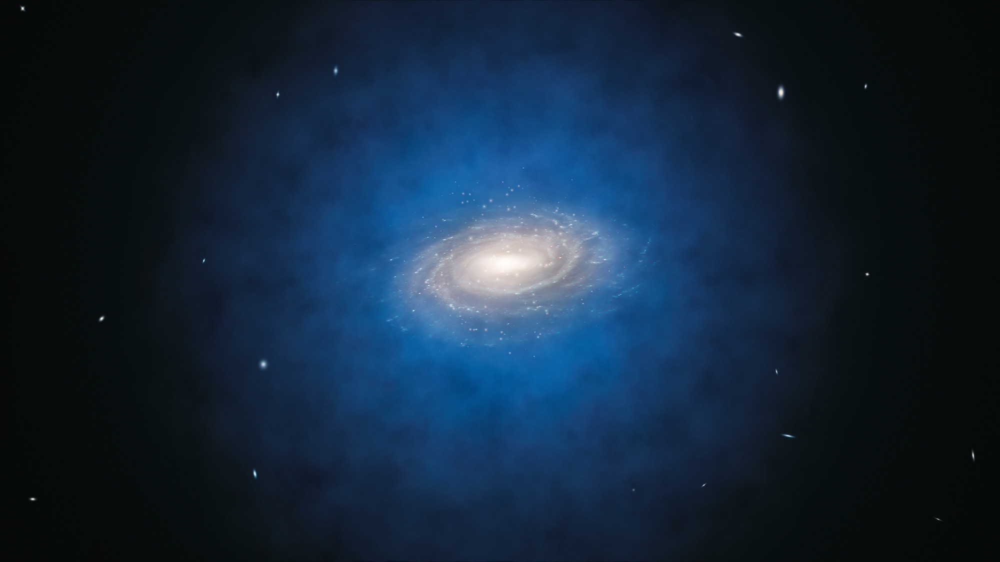

# Weighing the Milky Way with Machine Learning

This repository presents a couple of machine learning algorithm used to determine the mass of our galaxy, the Milky Way.

## Introduction

Most of the mass of our galaxy is not in normal matter such as the one the Sun, the Earth or humans are made of, but it is actually found in the form of dark matter. We do not know what dark matter is, but our best guess is that it is an elementary particle that does not interact with light, which is why we cannot observe it directly. The dark matter surrounds our galaxy up to large distances and to determine its mass we will use the number and motion of smaller galaxies that orbit the Milky Way. This setup is illustrated in Figure 1 below.

|  |
|:------:|
| Figure 1: *An illustration of the Milky Way. The Milky Way is shown at the centre of the image as the bright tilted disk. The blue haze surrounding our galaxy is the dark matter distribution which extends to larger distances than the stars. To measure the dark matter mass we will use the dots of light close to the edges of the image. These are smaller galaxies that orbit around the Milky Way, akin to how planets orbit the Sun.* |

To better understand the problem, one can compare it to determining the amount of honey in a beehive by measuring the number of bees and how fast they move to and from the beehive. This is illustrated in Figure 2, and makes for a "very sweet" comparison.

|  |
|:------|
| Figure 2: *Measuring the mass of our galaxy is similar to determining how much honey there is in the beehive. For this latter problem, we will use the number of bees and how fast they move to determine the amount of honey.* |  

To measure the mass of our galaxy, we will use 10 features, as described below. To make it easier to follow the problem, we will discuss in parallel the equivalent features for the problem of determining the amount of honey in a beehive. For the beehive case, there is also a **bold** text within the brackets that gives a short motivation of why this feature might be inportant for the problem at hand.

| Number of features | The mass of the Milky Way | The amount of honey in a beehive |
|:---:|:------|:----|
| 1 | The size of the Milky Way.| The size of the beehive. **(A bigger beehive can store more honey.)** |
| 5 | The number of galaxies orbiting the Milky Way. We count very small, small, medium, large, and very large galaxies (5 features in total).| The number of bees of different sizes (for this analogy lets forget that all bees have the same size). **(More and larger bees gather more honey.)** |
| 2 | The mean speed with which galaxies orbit the Milky Way. Two features: 1) the speed with which galaxies come towards the Milky Way, and 2) the speed with which galaxies rotate around the Milky Way. | The mean speed with which bees move towards and around the beehive. **(Faster moving bees gather more honey.)** |
| 1 | A combination of the speed and distance of a galaxy from the Milky Way.| A combination of the speed and distance of bees from the beehive. **(This can be important since bees might move faster when far away and slower when next to the beehive.)** |
| 1 | The mean distance of galaxies from the Milky Way. | The mean distance of bees from the beehive. **(The farther the bees go the more honey they can gather.)**|

The dataset used for training and testing the ML pipeline consists of nearly 1.5 million entries that have been measured from a supercomputer simulation of the formation of galaxies like the Milky Way. In this repository, to speed the ML training, we will only use a subset of 50,000 entries that are split 60:40 into training and test sets. That is, there are 30,000 entries used for training and the remaining 20,000 for testing the accuracy of the ML pipeline. We employ a regression pipeline, so the accuracy will be quantified as the **mean squared error (MSE)**.

The machine learning pipelines are split accross three Jupyter notebooks. The following contains a short description of the analysis performed in each notebook.

## Feature exploration: [exploratory_data_analysis.ipynb](exploratory_data_analysis.ipynb)

It includes an analysis and visualisation of the relation between input features and output. Concretely, it contains :
1. an analysis of the correlations between the 10 input features:
    - a couple of input features are highly correlated and have VIF>5 (VIF=Variance Inflation Factor).
    - removing the feature with the highest VIF results in a considerably smaller amount of correlation between input features, with the remaining features having VIFs below 2.
2. visualisation of the relation between each input feature and the output:
    - this is shown as a 2D histogram of output vs. feature i.
    - it also shows running percentiles, that is the percentiles of the PDF of the output variable in bins of the input feature.
    - the Pearson and Spearman rank correlation coefficients.
    - a simple 1D kNN analysis of how accurately each input feature can predict by itself the output.

> *Note:* The preprocessing of features is not shown since many of the choices are motivated by understanding the problem being solved. But some of the steps involve removing outliers and noise, and dealing with the many orders of magnitude in some variables by taking their logarithm.

## Using a k Nearst Neighbor (kNN) model: [prediction_kNN.ipynb](prediction_kNN.ipynb)

It presents a simple kNN model (`sklearn.neighbors.KNeighborsRegressor`) for predicting the output using the 10 input features. The steps of the pipeline are as follows:
1. splitting the dataset into a training and test sets using a 60:40 split.
2. rescaling the input features to the [0,1] range using the `sklearn.preprocessing.MinMaxScaler`.
3. creating the *model's complexity* to find the optimal value of the k hyperparameter (this is the optimal number of neighbors).
4. permutation importance analysis using `sklearn.inspection.permutation_importance`. This is used to determine which features are the most important.
5. permutation importance analysis for the set of reduced features that removes the multicollinearity in the input features.
6. construction of a simpler model with only 6 features. In this case, the 5 features that encode the number of very small, small, ..., very large galaxies is combined into a single feature. This model performs performs nearly as well as the full 10 feature model (MSE increases by only 0.5%).

## Using the Gradient Boosting Regressor (GBR) model: [prediction_GBR.ipynb](prediction_GBR.ipynb)

It models the data using the GBR technique (`sklearn.ensemble.GradientBoostingRegressor`). It consists of an ensemble of weak prediction models, in our case decission trees, with each successive tree being trained on the residuals (prediction error) of the previous trees. This results in a single strong learner and, in principle, as long as we control for overfitting, the prediction should improve each time a new tree is added to the ensemble. Gradient-boosting trees are one of the leading tools used in ML competitions such as those on [Kaggle.com](https://www.kaggle.com/competitions).

The notebook contains the following steps:
1. splitting the dataset into a training and test sets using a 60:40 split.
2. rescaling the input features to the [0,1] range using the `sklearn.preprocessing.MinMaxScaler`. This step is not needed for the GBR method, but we do it anyway to ease comparison with the predictions of the kNN model.
3. finding the optimal value of the model hyperparameters. GBR contains several hyperparameters and we optimize for the three most important ones:
    - the number of trees (for example, this is equivalent to the number of training epochs for a neural network).
    - the depth of the tree and the minimum number of samples required to split a node.
    - this is a multidimensional optimization problem and to make it tractable we first optimize for the number of trees, and in a second step for the depth and minimum number of samples.
    - to further speed up the optimization, we used a rather large value of the learning rate, which will be suitably decreased in the final model.
4. the optimal GBR model leads to a lower MSE than the kNN model, but the increase is rather modest -- only a 4% decrease in the loss function.
5. permutation importance analysis of the GBR model and comparison with the same result for the kNN model. We find some considerable difference between GBR and kNN feature importances.
